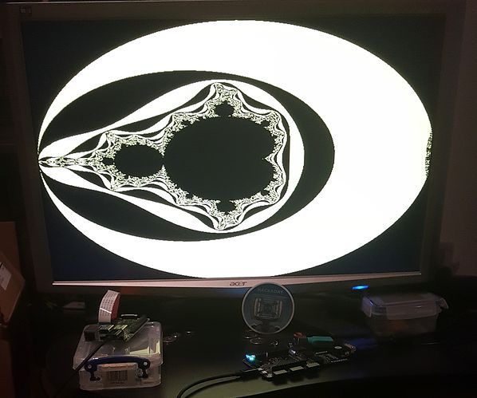

# High Level Synthesis

The [C2 SoC][] which uses high-level synthesis to generate a SoC is available on BlackIce.

[C2 SoC]:								https://github.com/combinatorylogic/soc

## How to build

Install dependencies: get swi-prolog and mono (and, of course, yosys, arachne and icestorm). e.g., on Ubuntu 16.04:

	$ apt-get install swi-prolog mono-complete  yosys arachne-pnr fpga-icestorm fpga-icestorm-chipdb arachne-pnr-chipdb iverilog verilator

Install MBase:

	$ git clone https://github.com/combinatorylogic/mbase
	$ cd mbase/bin; make; sudo ./install.sh

Then, clone the git repository:

	$ git clone https://github.com/combinatorylogic/soc
	$ cd soc && git submodule update --init --recursive
	$ cd soc && make clikecc.exe

Now, build a BlackIce .bin file for the demo:

	$ cd soc/backends/c2
	$ make blackice2mandhls

The resulting bitfile is in soc/backends/c2/hw/blackice2/c2_soc.bin

The VGA output is on PMOD 7/8/9/10 (using the Digilent PmodVGA module).

