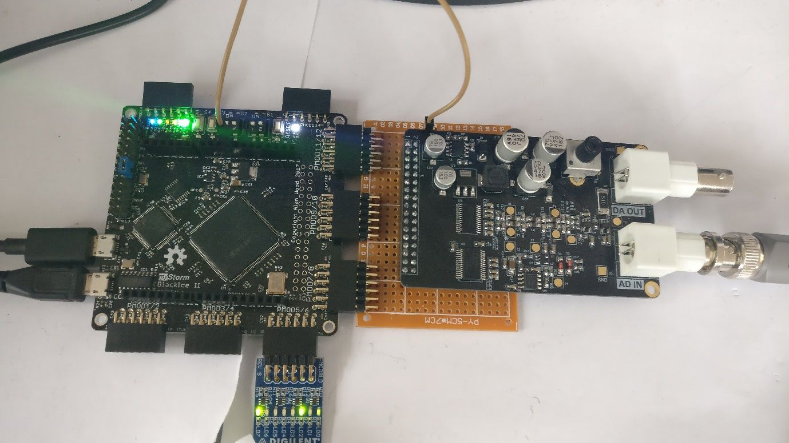
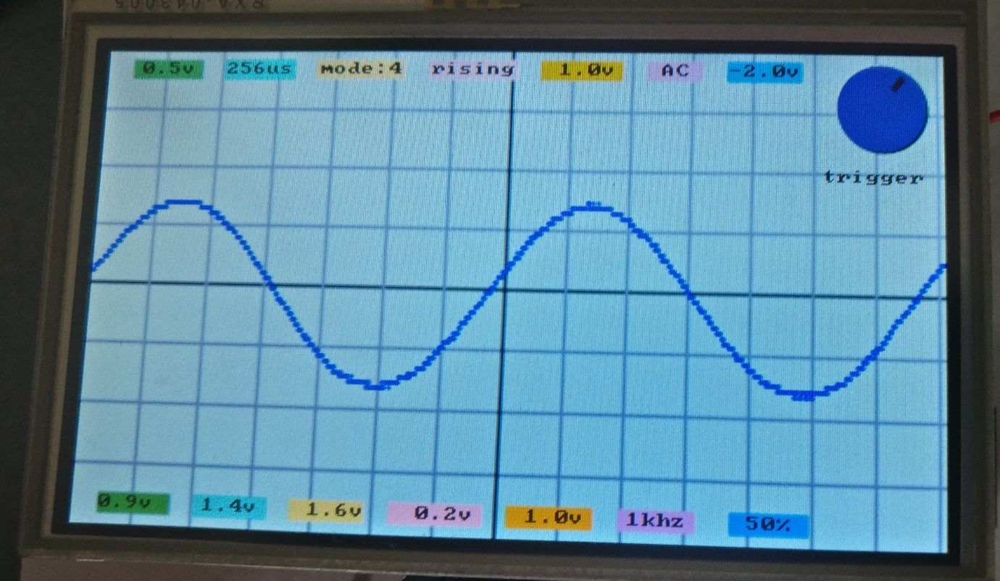
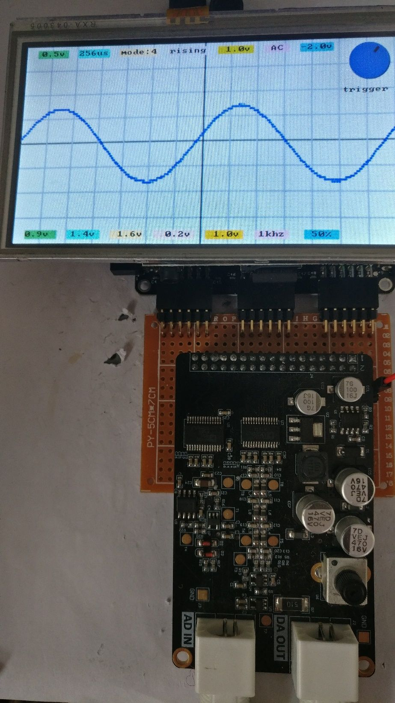

# Oscilloscopes

The Alinx AN108 8-bit AD/DA device is suitable for use as an oscilloscope. The AD device samples at up to 32MSPS and supports input from -5v to +5v.

Here is an oscilloscope using a Gameduino 3 screen and the AN108:

The [oscilloscope application][1] is written using the Arduino myStorm package.

The way the oscilloscope works is that the FPGA sets the AN108 clock speed and reads samples from the AN108 into BRAM. It periodically send an interrupt to the STM32 Arduino application which then uses QSPI to send the Ice40 any new relevant parameters and to read back the samples. The relevant parameters are the capture speed, mode, and trigger type and value. The mode is used for generating test signals, and the speed is implemented as a limit value for a pre-scaler. Here is the [FPGA oscilloscope application][2].

When it receives the data, the Arduino application processes the samples, and it displays it as a graph. It also calculates various measurements and displays them at the bottom of the screen.

The user interface consists of a set of buttons for the changeable parameters along the top of the screen and a touch screen dial to change the parameters. Than AN108 DA output could be used to generate signals.

[1]:									https://github.com/lawrie/verilog_examples/blob/master/fpga/oscilloscope/oscilloscope/oscilloscope.ino
[2]:									https://github.com/lawrie/verilog_examples/blob/master/fpga/oscilloscope/oscilloscope.v

