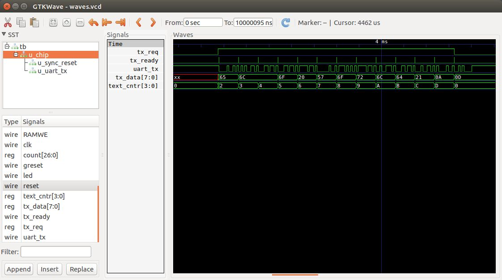

# Simulation

Simulation is a useful technique to see debug and verify your Verilog modules.

To use simulation, you need to write a test bench system Verilog file, usually called tb.v.

The BlackIce hello_world example has such a test bed file:

	`timescale 1ns/100ps
	module tb();
		initial begin
			$dumpfile("waves.vcd");
			$dumpvars(0, u_chip);
		end

		reg clk;
		reg reset;

		initial begin
			clk = 1'b0;
		end

		initial begin
			reset = 1'b1;
			repeat(10) @(posedge clk);

			reset = 1'b0;
			repeat(1000000) @(posedge clk);

			$finish;
		end

		always begin
			#5 clk = !clk;
		end

		chip u_chip(
			.clk(clk),
			.greset(reset)
		);

	endmodule

This generates a a 100Mhz clk signal by reversing clk every 5 nanoseconds. It generates a reset signal for 10 clk cycles and then run the top level Verilog file for 1 million cycles which is 10 milliseconds.

To run this file, type “make sim” and a file called waves.vcd is produced. The Makefile uses iverilog to produce an executable, which it then runs.

You can analyse the waves.vcd file by running the gtkwave application: “gtkwave waves.vcd”.

You can then select the signals you want to see and append them to the display.

Here is the relevant output

